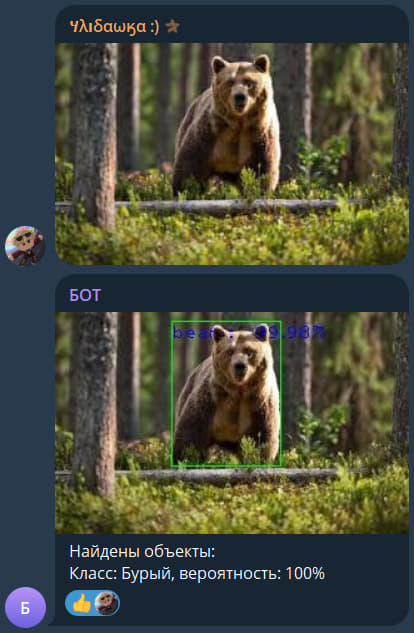

# 🐻 Bear Classification Telegram Bot

**Bear Classification Bot** — это Open-Source проект интеллектуального Telegram-бота, который объединяет две разные архитектуры нейросетей для точного распознавания видов медведей.

## 📝 Описание
Проект демонстрирует профессиональный подход к компьютерному зрению (Computer Vision) через создание "конвейера" обработки данных:

1.  **Детекция (YOLOv3)**: На первом этапе бот сканирует изображение и находит объект `bear`. Это позволяет игнорировать лишние детали на фоне и сосредоточиться на цели.
2.  **Кроппинг**: Система автоматически вырезает найденного медведя, подготавливая чистый фрагмент для детального анализа.
3.  **Классификация (Keras/TensorFlow)**: Вырезанный фрагмент обрабатывается моделью, обученной в Teachable Machine. Она определяет конкретный вид: бурый, белый медведь, панда и другие.
4.  **Обратная связь**: Бот возвращает пользователю результат с указанием вида и вероятности (Confidence Score).

## 💡 Почему это полезно?
* **Масштабируемость**: Вы можете заменить модель классификации на любую другую (например, распознавание марок машин или сортов растений), сохранив общую логику детекции.
* **Точность**: Благодаря предварительной детекции, классификатор получает только нужный объект, что значительно снижает количество ошибок.
* **Open Source**: Код полностью открыт для изучения и доработки сообществом.

## 🛠 Технологии
* **Python** (основной язык разработки)
* **pyTelegramBotAPI** (интерфейс бота)
* **ImageAI / YOLOv3** (обнаружение объектов)
* **TensorFlow / Keras** (нейросетевая классификация)

## 📸 Пример работы

*Бот находит медведя, выделяет его рамкой и проводит классификацию вида.*

## 🚀 Инструкция по установке
1. Склонируйте репозиторий:
   git clone [https://github.com/ylubawka/Bear-Classification-Bot.git](https://github.com/ylubawka/Bear-Classification-Bot.git)
   
2.Установите зависимости:
pip install pyTelegramBotAPI tf-keras pillow imageai tensorflow python-dotenv

3.Разместите файлы моделей (yolov3.pt, keras_model.h5, labels.txt) в папку cv_models/.

4.Создайте файл .env в корневой директории и добавьте ваш токен:
Фрагмент кода
TG_API_TOKEN=ваш_токен_от_BotFather

5.Запустите бота: python bot.py
